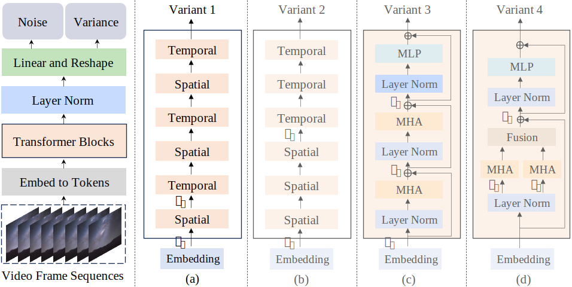

## Latte: Latent Diffusion Transformer for Video Generation<br><sub>Official PyTorch Implementation</sub>

### [Paper](https://maxin-cn.github.io/latte_project/) | [Project Page](https://maxin-cn.github.io/latte_project/)


This repo contains PyTorch model definitions, pre-trained weights and training/sampling code for our paper exploring 
latent diffusion models with transformers (Latte). You can find more visualizations on our [project page](https://maxin-cn.github.io/latte_project/).

> [**Latte: Latent Diffusion Transformer for Video Generation**](https://maxin-cn.github.io/latte_project/)<br>
> [Xin Ma](https://maxin-cn.github.io/), [Yaohui Wang](https://wyhsirius.github.io/), [Gengyun Jia](https://scholar.google.com/citations?user=_04pkGgAAAAJ&hl=zh-CN) [Xinyuan Chen](https://scholar.google.com/citations?user=3fWSC8YAAAAJ), [Yuan-Fang Li](https://users.monash.edu/~yli/), [Cunjian Chen](https://cunjian.github.io/), [Ziwei Liu](https://liuziwei7.github.io/), [Yu Qiao](https://scholar.google.com.hk/citations?user=gFtI-8QAAAAJ&hl=zh-CN)
> <br>Department of Data Science \& AI, Faculty of Information Technology, Monash University <br> Shanghai Artificial Intelligence Laboratory, S-Lab, Nanyang Technological University<br>

We propose a novel method, Latent Diffusion Transformer for Video Generation, referred to as Latte. Specifically, Latte enables an image-oriented Transformer as the backbone to capture the spatial and temporal information of videos while keeping the original network structure unchanged. This is achieved by alternately using the Transformer block to learn the spatial and temporal information in videos respectively and it also reduces computational complexity. To further improve the quality of generated videos, we determine the best practices of Latte through rigorous experimental analysis (including the learning strategies, temporal positional embedding, image-video joint training, etc.). Our comprehensive evaluation demonstrates that Latte achieves state-of-the-art performance across several standard video generation benchmarks, including FaceForensics, SkyTimelapse, UCF101, and Taichi-HD, outperforming current best models. In addition, we extend Latte to the text-to-video (T2V) domain, where Latte also achieves remarkable results compared to the current leading T2V models. We strongly believe that Latte provides valuable insights for future research on incorporating Transformers into diffusion models for video generation.

 

This repository contains:

* 🪐 A simple PyTorch [implementation](models/lavita.py) of Latte
* ⚡️ Pre-trained Latte models trained on FaceForensics, SkyTimelapse, Taichi-HD and UCF101 (256x256)

* 🛸 A Latte [training script](train.py) using PyTorch DDP


## Setup

First, download and set up the repo:

```bash
git clone https://github.com/maxin-cn/Latte.git
cd Latte
```

We provide an [`environment.yml`](environment.yml) file that can be used to create a Conda environment. If you only want 
to run pre-trained models locally on CPU, you can remove the `cudatoolkit` and `pytorch-cuda` requirements from the file.

```bash
conda env create -f environment.yml
conda activate latte
```


## Sampling 

**Pre-trained Latte checkpoints.** You can sample from our pre-trained Latte models with [`sample.py`](sample/sample.py). Weights for our pre-trained Latte model can be found [here](https://huggingface.co/maxin-cn/Latte). The script has various arguments to adjust sampling steps, change the classifier-free guidance scale, etc. For example, to sample from our model on FaceForensics, you can use:

```bash
bash sample/ffs.sh
```

or if you want to sample hundreds of videos, you can use the following script with Pytorch DDP:

```bash
bash sample/ffs_ddp.sh
```

## Training

We provide a training script for Latte in [`train.py`](train.py). This script can be used to train class-conditional and unconditional
Latte models. To launch Latte (256x256) training with `N` GPUs on the FaceForensics dataset 
:

```bash
torchrun --nnodes=1 --nproc_per_node=N train.py --config ./configs/ffs/ffs_train.yaml
```

or If you have a cluster that uses slurm, you can also train Latte's model using the following scripts:

 ```bash
sbatch slurm_scripts/ffs.slurm
```

We also provide the video-image joint training scripts [`train_with_img.py`](train_with_img.py). Similar to [`train.py`](train.py) scripts, this scripts can be also used to train class-conditional and unconditional
Latte models. For example, if you wan to train Latte model on the FaceForensics dataset, you can use:

```bash
torchrun --nnodes=1 --nproc_per_node=N train.py --config ./configs/ffs/ffs_img_train.yaml
```

<!-- ## BibTeX

```bibtex
@article{Peebles2022DiT,
  title={Scalable Diffusion Models with Transformers},
  author={William Peebles and Saining Xie},
  year={2022},
  journal={arXiv preprint arXiv:2212.09748},
}
``` -->


## Acknowledgments
Video generation models are improving quickly and the development of Latte has been greatly inspired by the following amazing works and teams: [DiT](https://github.com/facebookresearch/DiT), [U-ViT](https://github.com/baofff/U-ViT), and [Tune-A-Video](https://github.com/showlab/Tune-A-Video).


## License
The code and model weights are licensed under [CC-BY-NC](license_for_usage.txt).
